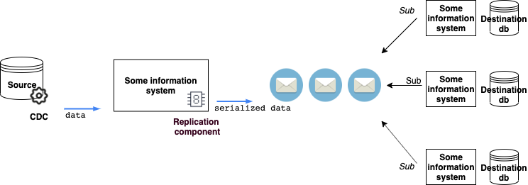

# Репликация данных с помощью механизма CDC на базе SQL server

Компонент репликации данных, встраивающийся в ИС без необходимости их модификации.
Реализован с помощью механизма Change Data Capture и брокера сообщений Apache Kafka.

